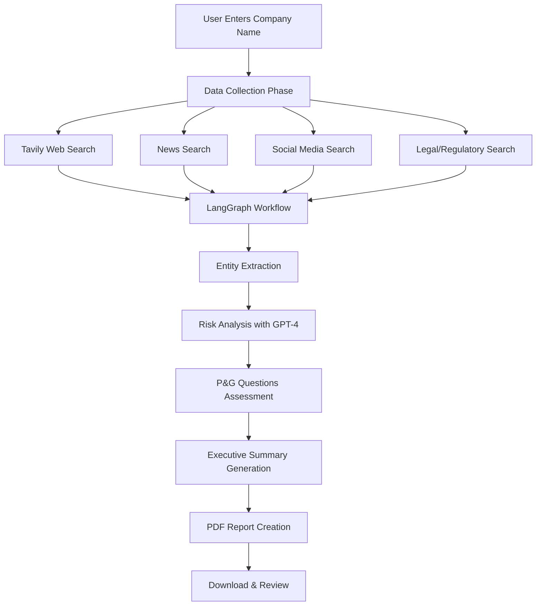

# 🔍 AI-Powered Client Vetting & Brand-Safety Compliance Tool

An advanced AI-driven platform that automates company vetting, risk assessment, and brand safety compliance checking using GPT-4, LangGraph, and comprehensive web intelligence.

---

## 🚀 **Key Features**

### ✅ **Comprehensive Intelligence Gathering**
- **Multi-Source Web Search**: Tavily-powered advanced search across web, news, and social media
- **Social Media Analysis**: Twitter, LinkedIn, Reddit, Facebook monitoring
- **Legal & Regulatory Tracking**: SEC violations, lawsuits, enforcement actions
- **Executive Background Checks**: Leadership team reputation analysis

### 🤖 **Advanced AI Processing**
- **GPT-4 Turbo Integration**: Best-in-class language model for analysis
- **LangGraph Workflow**: Sophisticated NLP orchestration with multi-step reasoning
- **Entity Extraction**: Automatic identification of key people, events, and risks
- **Sentiment Analysis**: AI-powered reputation assessment

### 📊 **P&G Brand Safety Compliance**
Automated evaluation of 7 critical questions:
1. Positive corporate reputation?
2. Free from current & serious public scandals?
3. No regulatory violations?
4. No legal violations?
5. Executives free from serious misconduct?
6. No PR risk events?
7. Brand safety compliant?

### 📄 **Professional Reporting**
- **Audit-Ready PDF Reports**: Professional multi-page reports with citations
- **Executive Summaries**: Clear APPROVED/REJECTED/REVIEW recommendations
- **Source Citations**: Full transparency with traceable evidence
- **Risk Scoring**: Categorized severity levels (Critical/High/Medium/Low)

---

## 🛠️ **Technology Stack**

| Component | Technology |
|-----------|-----------|
| Frontend | Streamlit (Python Web Framework) |
| AI/NLP | OpenAI GPT-4 Turbo, LangGraph |
| Search Engine | Tavily API |
| PDF Generation | ReportLab |
| Orchestration | LangChain, LangGraph |
| Environment | Python 3.9+ |

---

## 📦 **Installation & Setup**

### **Prerequisites**
- Python 3.9 or higher
- pip (Python package manager)
- Active internet connection

### **Step 1: Clone or Download Project**
```bash
cd "d:\Test natural tread proj"
```

### **Step 2: Install Dependencies**
```bash
pip install -r requirements.txt
```

This will install:
- Streamlit for web interface
- OpenAI for GPT-4 integration
- LangGraph for NLP orchestration
- Tavily for advanced web search
- ReportLab for PDF generation
- All supporting libraries

### **Step 3: Configure API Keys**
Create a `.env` file in the project root with your API keys:

```env
TAVILY_API_KEY=your_tavily_api_key_here
OPENAI_API_KEY=your_openai_api_key_here
LANGCHAIN_API_KEY=your_langchain_api_key_here
```

**Required API Keys:**
- ✅ **OPENAI_API_KEY**: Get from [OpenAI Platform](https://platform.openai.com/api-keys)
- ✅ **TAVILY_API_KEY**: Get from [Tavily](https://tavily.com/)
- ✅ **LANGCHAIN_API_KEY**: Get from [LangChain](https://smith.langchain.com/) (optional for tracing)

⚠️ **Important**: Never commit your `.env` file to git! It's already listed in `.gitignore`.

### **Step 4: Run the Application**
```bash
streamlit run app.py
```

The application will automatically open in your default web browser at:
```
http://localhost:8501
```

---

## 🎯 **How to Use**

### **Basic Usage**
1. **Enter Company Name**: Type the company you want to vet (e.g., "Tesla", "Microsoft")
2. **Optional**: Add specific executive names to investigate
3. **Click "Run Vetting Analysis"**: Wait 30-60 seconds for complete analysis
4. **Review Results**: Examine risk analysis, P&G compliance, and data sources
5. **Download PDF**: Get professional audit-ready report

**Note**: All searches are automatically performed at Deep Search level for comprehensive analysis.

### **Understanding Results**

#### **Executive Summary**
- **Overall Recommendation**: APPROVED / REJECTED / REQUIRES REVIEW
- **Key Findings**: 3-5 bullet point summary
- **Risk Level**: Low / Medium / High / Critical

#### **Risk Analysis Tab**
- Detailed assessment of severity, recency, credibility
- Pattern analysis (isolated vs. systematic issues)
- PR impact evaluation

#### **P&G Questions Tab**
- YES/NO/MAYBE answers for each question
- Confidence levels (High/Medium/Low)
- Specific reasoning with evidence

#### **Data Sources Tab**
- General search results
- News articles
- Legal/regulatory findings
- Social media mentions

---

## 📁 **Project Structure**

```
Test natural tread proj/
│
├── app.py                          # Main Streamlit application
├── requirements.txt                # Python dependencies
├── .env                           # API keys and configuration
├── README.md                      # This file
│
├── utils/
│   ├── api_calls.py              # Web search & data collection
│   ├── langgraph_workflow.py     # LangGraph AI workflow
│   ├── pdf_generator.py          # PDF report generation
│   └── risk_scoring.py           # Risk scoring utilities (legacy)
│
└── reports/                       # Generated PDF reports (auto-created)
```

---

## 🔄 **System Workflow**



---

## 🎨 **Advanced Features**

### **LangGraph Workflow Nodes**
1. **Extract Entities**: Identifies executives, incidents, dates
2. **Analyze Risks**: GPT-4 powered risk assessment
3. **Answer Questions**: Maps findings to P&G criteria
4. **Generate Report**: Creates executive summary

### **AI Prompting Strategy**
- **Low Temperature (0.1)**: Ensures consistent, factual analysis
- **Structured Prompts**: Role-based system messages
- **Context Preservation**: Multi-step reasoning with state management

### **Search Optimization**
- **Query Generation**: Context-aware search queries
- **Source Diversity**: Multiple search types (general, news, legal, social)
- **Relevance Filtering**: AI-powered content prioritization

---

## 🔒 **Compliance & Ethics**

### **Non-Discrimination**
- No protected demographic attributes used
- Only behavior, incidents, and verified events assessed
- Full audit logs for transparency

### **Data Privacy**
- No personal data stored beyond session
- All data sourced from public sources
- Reports stored locally only

### **Accuracy**
- AI outputs backed with human-readable reasoning
- Source citations included for verification
- Confidence levels provided for all assessments

---

## 🐛 **Troubleshooting**

### **Common Issues**

**Issue**: "Module not found" error
```bash
# Solution: Reinstall dependencies
pip install -r requirements.txt --upgrade
```

**Issue**: "API key not found" error
```bash
# Solution: Check .env file exists and has correct keys
# Verify keys are not expired
```

**Issue**: "Connection timeout" error
```bash
# Solution: Check internet connection
# Tavily API may be rate limited - wait 1 minute and retry
```

**Issue**: PDF generation fails
```bash
# Solution: Ensure reports/ directory exists
mkdir reports

# Check write permissions
```

### **Performance Tips**
- All analyses use Deep Search for comprehensive vetting (60+ seconds)
- Ensure stable internet connection for best results
- Large companies may take slightly longer due to more data sources

---

## 📊 **Metrics & Benchmarks**

### **Typical Performance**
- **Data Collection**: 10-15 seconds
- **AI Analysis**: 15-25 seconds
- **PDF Generation**: 2-5 seconds
- **Total Runtime**: 30-60 seconds

### **Data Sources Checked**
- **Web Search**: 10-30 results
- **News Articles**: 10-25 articles
- **Legal Sources**: 5-15 documents
- **Social Media**: 10-20 mentions

---

## 🚧 **Future Enhancements**

### **Phase 2 Features** (2-4 weeks)
- [ ] LexisNexis integration
- [ ] Factiva integration
- [ ] Multi-user authentication
- [ ] Admin dashboard
- [ ] Historical vetting database
- [ ] Batch processing

### **Phase 3 Features** (4-8 weeks)
- [ ] Real-time monitoring
- [ ] Alert system for new risks
- [ ] API endpoints
- [ ] Mobile app
- [ ] Advanced analytics dashboard

---

## 📞 **Support & Contact**

### **Technical Support**
- Review this README for common solutions
- Check the `.env` file for API key configuration
- Ensure all dependencies are installed correctly

### **Enhancement Requests**
- Document specific feature needs
- Provide example use cases
- Share feedback on current functionality

---

## 📝 **Version History**

### **Version 2.0** (Current)
- ✅ GPT-4 Turbo integration
- ✅ LangGraph NLP orchestration
- ✅ Tavily comprehensive search
- ✅ Social media analysis
- ✅ Professional PDF reports
- ✅ P&G compliance framework
- ✅ Multi-source intelligence

### **Version 1.0** (Legacy)
- Basic DuckDuckGo search
- Simple keyword-based risk scoring
- Minimal reporting

---

## 📄 **License**

This is a proprietary system developed for Natural Trends. All rights reserved.

---

## 🎯 **Quick Start Summary**

```bash
# 1. Install dependencies
pip install -r requirements.txt

# 2. Run the app
streamlit run app.py

# 3. Open browser to http://localhost:8501

# 4. Enter company name and click "Run Vetting Analysis"

# 5. Review results and download PDF report
```

---

**Built with ❤️ using GPT-4, LangGraph, and Tavily**

*Last Updated: December 3, 2025*
